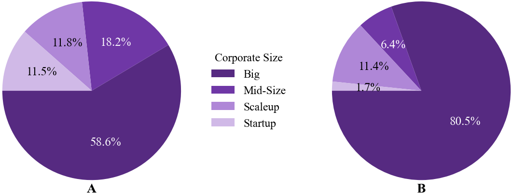
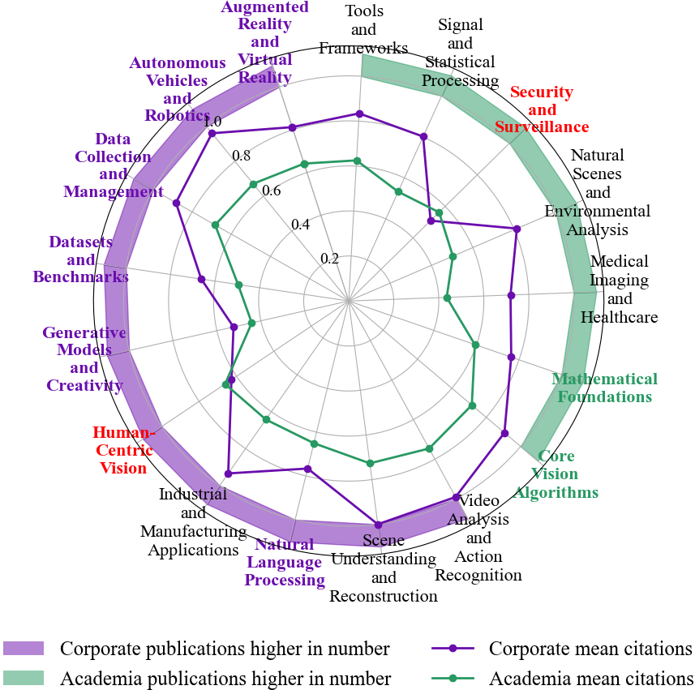

# University of Tuebingen Data Literacy WiSe 24 Project

# Corporate vs. Academia: Who Dominates Computer Vision Conferences?

Corporate involvement in computer vision research has grown significantly, raising questions about its influence on the field. This study analyzes corporate-affiliated papers in top-tier conferences (CVPR, ICCV, WACV) to assess publication trends, impact, and research focus. While academia still dominates in volume, corporate contributions have steadily increased, reaching record levels. Industry papers receive higher citations on average and are concentrated among a few large tech firms. Corporate research leans toward high-impact and applied areas while academia emphasizes theoretical foundations. These trends highlight the need for stronger academic-industry collaboration and open research initiatives to maintain a balanced research landscape.

## Results

### Growth of Corporate-Affiliated Research

(A) Corporate affiliated paper ratio shows an increasing trend (from 2019 to 2024) with CVPR and ICCV maintaining higher ratios compared to WACV and reaching record levels in corporate affiliation. The accompanying table (B) presents Spearman’s rank correlation coefficients, all of which indicate strong positive correlations (coefficients exceeding 0.88). Statistically significant values (p < 0.05) are marked with an asterisk (*).

### Citation Impact of Corporate-Affiliated Research

Absolute (A) and kernel density estimate (B) citation distributions of academic and
corporate papers show that corporate papers tend to have higher mean citations and a wider spread in
their citation counts. In contrast, academic papers are more numerous but are generally concentrated
in lower citation ranges.

To formally test whether corporate papers have a significantly higher mean citation count (μ₂) than academic papers (μ₁), since the data is not normally distributed, we conduct a Mann–Whitney U test [9] with a significance threshold of α = 0.05. The null (H₀) and alternative (Hₐ) hypotheses are as follows:

- **H₀**: μ₂ ≤ μ₁ (Corporate papers have a smaller or equal mean than academic papers)
- **Hₐ**: μ₂ > μ₁ (Corporate papers have a larger mean than academic papers)

The test results indicate that p-value ≪ 0.05, allowing us to reject H₀. This confirms a statistically significant difference, supporting the conclusion that corporate-affiliated papers tend to achieve higher citation impact compared to their academic counterparts.

### Influence of Large Corporations

Corporate size distribution (A) and paper contributions by corporate size (B) are based
on corporate institutions that participated in CVPR, ICCV, and WACV from 2019 to 2024. Large
institutions dominate both participation and research output, representing 58.6% of participating
institutions while contributing 80.5% of the total papers.

### Research Focus

Comparing the research focus of corporate and academic institutions. The shaded areas represent the number of paper contributions (corporate in purple, academia in green), while the lines indicate mean citation counts (corporate in purple, academia in green), normalized such that 1.0 corresponds to 70 citations. Corporate research dominates high-impact applied fields highlighted in purple in paper number. Academia leads in foundational fields highlighted in green in paper number. Notably, while corporate research generally receives more citations, academia remains influential in the fields highlighted in red.
